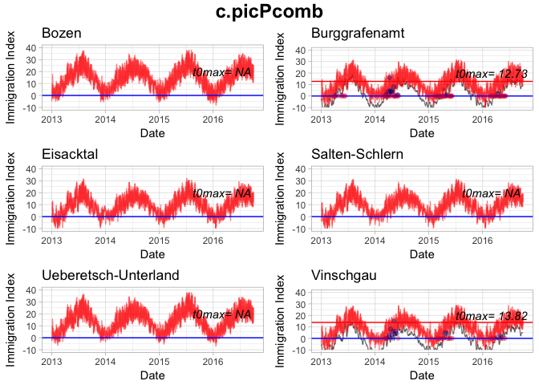

Prediction of flight onset of *Cacopsylla melanoneura* and *C. picta*, vectors
==============================================================================

of apple proliferation disease, using a temperature-based immigration analysis - Appendix A

Introduction
------------

This document is an appendix to the article: ''Prediction of flight onset of *Cacopsylla melanoneura* and *C. picta*, vectors of apple proliferation disease, using a temperature-based immigration analysis''. The document provides the calculation procedure for a temperature-based immigation analysis based on Tedeschi et al. (2012).

Data
----

##### Loading data and libraries

``` r
source("r-code/00_settings.R")
detachAllPackages() #detach("package:plyr", unload=TRUE) # makes problems with the group_by function
load(file="data/AP_rawdata_vector.RData")
load(file="data/AP_workingdata_clustering.RData")
load(file="data/AP_workingdata_vector.RData")
set.seed(2015)
```

``` r
if(!require(ggplot2))
{
  install.packages("ggplot2", repos = mir)
  require(ggplot2)
}
if(!require(plyr))
{
  install.packages("plyr")
  require(plyr)
}
if(!require(dplyr))
{
  install.packages("dplyr")
  require(dplyr)
}

if(!require(stringi))
{
  install.packages("stringi", repos = mir)
  require(stringi)
}

if(!require(scales))
{
  install.packages("scales", repos = mir)
  require(scales)
}
if(!require(MASS))
{
  install.packages("MASS", repos = mir)
  require(MASS)
}
if(!require(qtlcharts))
{
  install.packages("qtlcharts", repos = mir)
  require(qtlcharts)
}
```

#### Data preparation

P = parents, re-emigrants, overwintering vectors
F1 = offspring, emigrants
B = vector sampling method: beating tray
YT = vector sampling method: yellow traps

``` r
tempsum <- data.frame()

#pulling out site_id,,cluster, year, date and abundance for each insect_id and insect_stage_id
c.melPB <- c.melanoneuraPB[,c(2,3,4,5,6,10,11)]
c.melF1B <- c.melanoneuraF1B[,c(2,3,4,5,6,10,11)]
c.picPB <- c.pictaPB[,c(2,3,4,5,6,10,11)]
c.picF1B <- c.pictaF1B[,c(2,3,4,5,6,10,11)]
c.melPYT <- c.melanoneuraPYT[,c(2,3,4,5,6,10,11)]
c.melF1YT <- c.melanoneuraF1YT[,c(2,3,4,5,6,10,11)]
c.picPYT <- c.pictaPYT[,c(2,3,4,5,6,10,11)]
c.picF1YT <- c.pictaF1YT[,c(2,3,4,5,6,10,11)]

#renaming 'amount'
names(c.melPB)[6] <- 'abundance'
names(c.melF1B)[6] <- 'abundance'
names(c.picPB)[6] <- 'abundance'
names(c.picF1B)[6] <- 'abundance'
names(c.melPYT)[6] <- 'abundance'
names(c.melF1YT)[6] <- 'abundance'
names(c.picPYT)[6] <- 'abundance'
names(c.picF1YT)[6] <- 'abundance'

clusterSites <- unique(modeldata.t[,c(2,3)]) #site_id and cluster id
regionSites <- unique(sitesInsectVector[,c(1,3)])

#Combining beating and yellow trap subsets
c.melPcomb <- merge(c.melPB, c.melPYT, by = c("site_id","region","date","cluster","year"), all = TRUE)
c.melPcomb <- transform(c.melPcomb, abundance = rowSums(c.melPcomb[,c("abundance.x","abundance.y")], na.rm = TRUE))
c.melPcomb[, "presence"] <- apply(c.melPcomb[, c("presence.x","presence.y")], 1, max, na.rm=T)
c.melPcomb <- c.melPcomb[,-which(names(c.melPcomb) %in% c("abundance.x","abundance.y","presence.x","presence.y"))]#dropping uncombined columns
###
c.melF1comb <- merge(c.melF1B, c.melF1YT, by = c("site_id","region","date","cluster","year"), all = TRUE)
c.melF1comb <- transform(c.melF1comb, abundance = rowSums(c.melF1comb[,c("abundance.x","abundance.y")], na.rm = TRUE))
c.melF1comb[, "presence"] <- apply(c.melF1comb[, c("presence.x","presence.y")], 1, max, na.rm=T)
c.melF1comb <- c.melF1comb[,-which(names(c.melF1comb) %in% c("abundance.x","abundance.y","presence.x","presence.y"))]#dropping uncombined columns
###
c.picPcomb <- merge(c.picPB, c.picPYT, by = c("site_id","region","date","cluster","year"), all = TRUE)
c.picPcomb <- transform(c.picPcomb, abundance = rowSums(c.picPcomb[,c("abundance.x","abundance.y")], na.rm = TRUE))
c.picPcomb[, "presence"] <- apply(c.picPcomb[, c("presence.x","presence.y")], 1, max, na.rm=T)
c.picPcomb <- c.picPcomb[,-which(names(c.picPcomb) %in% c("abundance.x","abundance.y","presence.x","presence.y"))]#dropping uncombined columns
###
c.picF1comb <- merge(c.picF1B, c.picF1YT, by = c("site_id","region","date","cluster","year"), all = TRUE)
c.picF1comb <- transform(c.picF1comb, abundance = rowSums(c.picF1comb[,c("abundance.x","abundance.y")], na.rm = TRUE))
c.picF1comb[, "presence"] <- apply(c.picF1comb[, c("presence.x","presence.y")], 1, max, na.rm=T)
c.picF1comb <- c.picF1comb[,-which(names(c.picF1comb) %in% c("abundance.x","abundance.y","presence.x","presence.y"))]#dropping uncombined columns
###

#TEMPSUMLIST CREATION
#listnames <- c('c.melP','c.melF1','c.picP','c.picF1','c.melPYT','c.melF1YT','c.picPYT','c.picF1YT')
#tempsumlist <- list(c.melP,c.melF1,c.picP,c.picF1,c.melPYT,c.melF1YT,c.picPYT,c.picF1YT)
listnames <- c('c.melPcomb','c.melF1comb','c.picPcomb','c.picF1comb')
tempsumlist <- list(c.melPcomb,c.melF1comb,c.picPcomb,c.picF1comb)

names(tempsumlist) <- listnames


###############DECIDE IF SUM BY REGION OR CLUSTER HERE! #########################
#Sum by region
for(i in 1:length(tempsumlist)){
tempsumlist[[i]] <- as.data.frame(tempsumlist[[i]] %>% dplyr::group_by(date,year,region) %>% dplyr::summarise(abundance = sum(abundance,na.rm=T), presence=max(presence))) #combine all sites within same region at same date
}

list2env(tempsumlist,environment())  #overwrite single dataframes in the global environment

#merge all dataframes by columns
tempsum <- join_all(list(tempsum, c.melPcomb,c.melF1comb,c.picPcomb,c.picF1comb), type="full")
```

Temperature-based immigration analysis
--------------------------------------

##### Calculation of thresholds and indices

1.  a0 and aMax

``` r
##################################################################################################
#CALCULATING A0's = Date of first occurence for each site and year (+ species, generation and method)
a0 <-lapply(tempsumlist, function(j){
  sapply(split(j, list(j[,3],j[,2])), function(x){x[,1][which(x[,5]>0)[1]]}) #split by region||cluster||site + year and look for first date where insects are found
})
a0 <- lapply(a0, function(x) x[!is.na(x)]) #removing sites and year where no insect was found thus returning NA
for(i in 1:length(a0)){
  a0[[i]] <- as.data.frame(a0[[i]])
  a0[[i]]$datetime <- as.POSIXct(a0[[i]][,1], origin="1970-01-01")
  a0[[i]]$year <- format(a0[[i]]$datetime, format="%Y")
  #a0[[i]]$t0maxmin <- NA
  #a0[[i]]$t0maxmean <- NA
}

for(i in 1:length(a0)){ #Adding region||cluster||site_id to a0 as id
  for(j in 1:length(a0[[i]][,1])){
    a0[[i]]$region <- rownames(a0[[i]][1])
    a0[[i]]$region <- gsub('.{5}$', '', a0[[i]]$region) #cut off last 5 characters (e.g. Laimburg0001.2016 -> Laimburg0001 || Bozen.2013 <- Bozen for easier filtering of overall site min t0max)
  }
}

##################################################################################################
#CALCULATING aMax's = Date of max. abundance for each site (+ species, generation and method)
aMax <-lapply(tempsumlist, function(j){
  sapply(split(j, list(j[,3])), function(x){x[,1][which.max(x[,5])]}) #split by region||cluster||site and look for first date where max # of insects are found
})
aMax <- lapply(aMax, function(x) x[!is.na(x)])
for(i in 1:length(aMax)){
  aMax[[i]] <- as.data.frame(aMax[[i]])
  aMax[[i]]$datetime <- as.POSIXct(aMax[[i]][,1], origin="1970-01-01")
  aMax[[i]]$year <- format(aMax[[i]]$datetime, format="%Y")
}

for(i in 1:length(aMax)){ #Adding region||cluster||site_id to aMax as id
  for(j in 1:length(aMax[[i]][,1])){
    aMax[[i]]$region <- rownames(aMax[[i]][1])
  }
}
```

``` r
##################################################################################################
thourly <- weatherStationsHourly_split
thourly <- lapply(thourly, function(x) x[,-c(6:11)]) #removing unneeded columns
for(i in 1:nrow(clusterStations)){
  thourly[[i]]$cluster <- clusterStations$group[i]
}

for(i in 1:length(thourly)){
  thourly[[i]]$datetimenum <- as.POSIXct(thourly[[i]]$datetime, format="%Y-%m-%d")#cut off %H:%M:%S due to problems with numeric transformation
  thourly[[i]]$datetimenum <- as.numeric(thourly[[i]]$datetimenum)
}

#################################################
thourlyregion <- dplyr::bind_rows(thourly) #combine lists to 1 dataframe for dplyr
thourlyregion <- as.data.frame(thourlyregion %>% dplyr::group_by(datetime,datetimenum,region) %>% dplyr::summarise(temphourmean=mean(temphour, na.rm=T)))
thourlyregion <- split(thourlyregion, thourlyregion$region) #combine dataframes back into list
```

1.  Tmax and Tmedian

``` r
##################################################################################################
#CALCULATING TMax = Max. daily temperature & tmedian from hourly mean temps
tmax <- list()
tmedian <- list()


for(i in 1:length(weatherStationsHourly_split)){
tmax[[i]] <- aggregate(list(maxtempday=weatherStationsHourly_split[[i]][,4]),list(datetime=cut(as.POSIXct(weatherStationsHourly_split[[i]][,3]), "day")),FUN=max,na.rm=T)
tmax[[i]]$maxtempday[is.infinite(tmax[[i]]$maxtempday)] <- NA
tmax[[i]]$datetime[is.infinite(tmax[[i]]$datetime)] <- NA
tmax[[i]]$site_id <- names(weatherStationsHourly_split)[[i]]
tmax[[i]]$region  <- unique(weatherStationsHourly_split[[i]][1,5]) #repeating the stations region for easier filtering

tmedian[[i]] <- aggregate(list(mediantempday=weatherStationsHourly_split[[i]][,4]),list(datetime=cut(as.POSIXct(weatherStationsHourly_split[[i]][,3]), "day")),FUN=median,na.rm=T)
tmedian[[i]]$mediantempday[is.infinite(tmedian[[i]]$mediantempday)] <- NA
tmedian[[i]]$datetime[is.infinite(tmedian[[i]]$datetime)] <- NA
tmedian[[i]]$site_id <- names(weatherStationsHourly_split)[[i]]
tmedian[[i]]$region  <- unique(weatherStationsHourly_split[[i]][1,5]) #repeating the stations region for easier filtering
}


#naming the stations
names(tmax)    <- names(weatherStationsHourly_split)
names(tmedian) <- names(weatherStationsHourly_split)

#changing the datetime entry to numeric for easier filtering
for(i in 1:length(tmax)){
  tmax[[i]]$datetime <- as.POSIXct(tmax[[i]]$datetime, format="%Y-%m-%d")
  tmax[[i]]$datetime <- as.numeric(tmax[[i]]$datetime)
}

for(i in 1:length(tmedian)){
  tmedian[[i]]$datetime <- as.POSIXct(tmedian[[i]]$datetime, format="%Y-%m-%d")
  tmedian[[i]]$datetime <- as.numeric(tmedian[[i]]$datetime)
}


##################################################################################################
#adding cluster id & region to tmax and tmedian
for(i in 1:nrow(clusterStations)){
  tmax[[i]]$cluster <- clusterStations$group[i]
  tmedian[[i]]$cluster <- clusterStations$group[i]
}
```

1.  T0max

``` r
##################################################################################################
#T0Max = max of max daily temperature of 7 days preceding a0 (per observation, insect type and site)
#check a0 and then filter through txmax and tmedian at corresponding weatherstation (from cluster)
#using tmax
for(i in 1:length(a0)){ #loop through all species,generation and method
  for(j in 1:length(a0[[i]][,1])){ #loop through the a0 entries
    tmaxvec <- numeric()
    for(x in 1:length(tmax)){ #loop through ALL weather stations
      if(tmax[[x]]$region[1] == a0[[i]]$region[j] ){ #check which stations cluster id matches the current sites' cluster id
  tmaxvec  <- c(tmaxvec,max(tmax[[x]]$maxtempday[(which(tmax[[x]]$datetime == a0[[i]][,1][j])-7):(which(tmax[[x]]$datetime == a0[[i]][,1][j]))])) #temporary vector saving the max of daily max temperatures of the 7 days before a0 from all weather stations x that share the id with the site j
       print(paste(i,j,x))
      }
    }
    print(tmaxvec)
    a0[[i]]$t0max[j] <- min(tmaxvec, na.rm=T) #min of all weather station's 7 day max
    a0[[i]]$t0mean[j] <- mean(tmaxvec, na.rm=T) #mean of all max weekly temperatures
  }
 a0[[i]]$t0max[is.infinite(a0[[i]]$t0max)] <- NA
 a0[[i]]$t0mean[is.nan(a0[[i]]$t0mean)] <- NA
}
```

1.  T0maxmin and T0maxmean

``` r
##################################################################################################
#Minimum of all t0max/t0mean that belong to the same site over several years
t0maxmin <- list()
for(i in 1:length(a0)){
t0maxmin[[i]] <- as.data.frame(a0[[i]] %>% dplyr::group_by(region) %>% dplyr::summarise(t0maxmin = min(t0max,na.rm=T), t0meanmin = min(t0mean,na.rm=T)))
}
names(t0maxmin) <- names(a0)

for(i in 1:length(a0)){
  a0[[i]] <- join_all(list(a0[[i]], t0maxmin[[i]]), by="region", type="left")
}
```

1.  T0maxyears

``` r
##################################################################################################
#Min of t0maxmin by year for id (region || cluster) in order to check for regional differences
t0maxyears <- list()
for(i in 1:length(a0)){
t0maxyears[[i]] <- as.data.frame(a0[[i]] %>% dplyr::group_by(region) %>% dplyr::summarise(t0maxyears= min(t0maxmin,na.rm=T)))
}
names(t0maxyears) <- names(a0)

for(i in 1:length(a0)){
  a0[[i]] <- join_all(list(a0[[i]], t0maxyears[[i]]), by="region", type="left")
}
```

1.  DD

``` r
##################################################################################################
#Degree days DD = number of hours over t0max per week preceding a0

for(i in 1:length(a0)){
  for(j in 1:length(a0[[i]][,1])){
    DD <- numeric()
      for(x in 1:length(thourly)){
       #if(thourly[[x]]$cluster[1] == a0[[i]]$cluster[j]){
        if(thourly[[x]]$region[1] == a0[[i]]$region[j]){
          DD <-  c(DD,sum(as.numeric(thourly[[x]]$temphour[(which(thourly[[x]]$datetimenum == a0[[i]][,1][j])-(24*7)):(which(thourly[[x]]$datetimenum == a0[[i]][,1][j]))])>a0[[i]]$t0maxmin[j])) #(HINT: 24 hours * 7 days)
       }
      }
    print(DD)
    a0[[i]]$DD[j] <- mean(DD, na.rm=T)
  }
}
```

1.  T7n

``` r
############################################################################################
# mean max daily temperatures in 7 days before a0 (using Tmax (max daily temperatures))
for(i in 1:length(a0)){
  for(j in 1:length(a0[[i]][,1])){
    T7n <- numeric()
      for(x in 1:length(tmax)){
       #if(tmax[[x]]$cluster[1] == a0[[i]]$cluster[j]){
        if(thourly[[x]]$region[1] == a0[[i]]$region[j]){
          T7n <-  c(T7n,tmax[[x]]$maxtempday[(which(tmax[[x]]$datetime == a0[[i]][,1][j])-(7)):(which(tmax[[x]]$datetime == a0[[i]][,1][j]))]) #(HINT: 7 days since daily temp data)
       }
      }
    print(T7n)
    a0[[i]]$T7n[j] <- mean(T7n, na.rm=T)
  }
}
```

    ## [1]  8.383333 11.766667 12.583333 15.066667 14.733333 16.100000 16.533333
    ## [8] 12.666667
    ##  [1]  9.683333 10.050000  9.416667 12.733333 11.066667 14.750000 14.066667
    ##  [8] 13.066667 10.933333 10.616667 10.233333 14.433333 11.450000 15.366667
    ## [15] 15.500000 13.850000  6.900000  4.100000  5.933333  6.633333  7.200000
    ## [22]  8.650000  8.100000  5.883333  5.783333  3.066667  5.100000  8.450000
    ## [29]  5.833333  8.383333  7.600000  4.616667
    ##  [1]  4.566667  3.433333  5.700000  6.250000  5.100000  5.433333  5.616667
    ##  [8]  4.100000 10.650000  9.000000  9.550000 12.250000  8.950000 11.350000
    ## [15] 13.600000 10.350000  6.300000  4.600000  6.350000  7.300000  6.350000
    ## [22]  7.400000  8.300000  7.150000        NA        NA        NA        NA
    ## [29]        NA        NA        NA        NA
    ##  [1]  6.1500000  8.5333333  8.4000000 11.8000000 11.2666667 13.7166667
    ##  [7] 13.3333333  9.5166667         NA         NA         NA         NA
    ## [13]         NA         NA         NA         NA  1.9500000  4.7666667
    ## [19]  4.5166667  7.6000000  7.9000000  8.7500000  9.4333333  7.3166667
    ## [25]  3.7666667  6.7833333  6.5333333  8.7166667  8.4166667 11.1166667
    ## [31] 10.4833333  7.6166667 -0.5333333  3.8833333  3.0000000  5.8166667
    ## [37]  5.9666667  8.5666667  6.3500000  3.8666667
    ##  [1]  8.600000 11.216667 13.750000 14.583333 14.616667 15.666667 16.316667
    ##  [8] 12.983333  7.433333  9.200000 10.983333 13.566667 13.633333 15.716667
    ## [15] 14.800000 10.700000
    ## [1] 12.20000 11.88333 10.85000 13.30000 10.00000 14.50000 16.31667 18.00000
    ##  [1]  9.0333333 10.2833333 10.0000000  9.5500000 12.3666667  8.3500000
    ##  [7] 12.8833333 13.9000000  9.5166667 11.1500000 10.7666667 11.0166667
    ## [13] 14.6000000  9.2833333 14.4333333 15.8166667  3.7000000  2.5500000
    ## [19]  3.9500000  3.9000000  6.1666667  2.4666667  6.1666667  7.7666667
    ## [25]  1.6833333  1.8666667  1.6166667  4.5166667  6.7000000  0.9333333
    ## [31]  4.4666667  5.5166667
    ##  [1]  3.766667  4.666667  4.816667  9.516667  7.933333 10.483333  9.433333
    ##  [8] 10.666667        NA        NA        NA        NA        NA        NA
    ## [15]        NA        NA        NA        NA        NA        NA        NA
    ## [22]        NA        NA        NA 13.266667 13.750000 15.466667 16.816667
    ## [29] 19.016667 16.616667 16.300000 15.983333
    ##  [1]  8.100000  7.916667  8.100000 10.166667  6.333333 10.233333 11.316667
    ##  [8] 13.200000  5.050000  3.966667  5.666667  8.283333  4.166667  7.333333
    ## [15]  8.183333 11.366667  3.800000  3.450000  4.233333  4.816667  3.333333
    ## [22]  5.833333  6.916667  8.866667  6.200000  5.066667  7.116667  7.850000
    ## [29]  5.183333  8.833333  9.550000 11.583333  1.500000  0.450000  1.300000
    ## [36]  3.566667  0.800000  3.250000  4.483333  6.433333
    ##  [1]  3.100000  3.300000  8.416667  6.783333  8.250000  7.116667  7.100000
    ##  [8]  9.950000  5.266667  6.083333 11.250000 10.950000 10.216667  8.916667
    ## [15] 12.483333 12.333333 12.383333 13.383333 16.916667 18.000000 15.183333
    ## [22] 14.600000 14.816667 17.300000
    ##  [1]  7.41666667  5.76666667  7.35000000 11.15000000 11.83333333
    ##  [6] 12.35000000 10.73333333  9.56666667  9.26666667  6.60000000
    ## [11]  8.75000000 12.05000000 12.98333333 13.40000000 11.65000000
    ## [16] 11.26666667  3.08333333  1.31666667  1.65000000  2.21666667
    ## [21]  3.93333333  4.85000000  4.58333333  5.65000000  3.35000000
    ## [26]  0.08333333  1.55000000  5.18333333  8.26666667  8.76666667
    ## [31]  7.85000000  6.95000000
    ##  [1]  3.850000 -0.750000  2.550000  8.783333  9.350000  8.333333 10.183333
    ##  [8]  6.983333        NA        NA        NA        NA        NA        NA
    ## [15]        NA        NA        NA        NA        NA        NA        NA
    ## [22]        NA        NA        NA 12.350000  8.816667 11.800000 12.950000
    ## [29] 15.016667 11.550000 17.083333 16.483333
    ##  [1] 10.7500000  9.4666667  6.1000000  9.5833333 10.2500000 12.1833333
    ##  [7]  9.2833333 14.6166667  9.1166667  6.8500000  3.6833333  8.9500000
    ## [13]  9.0166667 11.0166667  8.1166667 13.5166667  5.8333333  6.4666667
    ## [19]  2.8666667  6.4500000  7.7500000  8.7166667  7.5500000 10.8666667
    ## [25]  8.4500000  8.5333333  3.8833333  9.3000000  9.0166667 11.3500000
    ## [31]  8.8833333 15.8500000  4.3666667  3.5333333  0.4166667  4.3166667
    ## [37]  6.6000000  7.5166667  6.0333333 10.6333333
    ##  [1] 15.80000 13.95000 14.83333 11.33333 17.38333 20.13333 16.35000
    ##  [8] 16.11667       NA       NA       NA       NA       NA       NA
    ## [15]       NA       NA
    ##  [1]  1.216667 -2.066667  2.733333  8.800000  6.350000  9.766667  8.250000
    ##  [8]  4.450000  4.183333  1.250000  4.866667 11.466667  7.633333  7.483333
    ## [15] 12.066667  8.600000  9.900000  7.266667 13.200000 11.866667 12.933333
    ## [22] 11.633333 18.366667 15.700000
    ##  [1]  3.3500000 10.1166667 12.4666667  8.3666667 13.1666667 10.9833333
    ##  [7] 10.0500000 11.0833333  8.5500000 11.7833333 12.4000000 10.0000000
    ## [13] 14.2833333 12.3166667 11.4166667 12.4166667  0.7833333  2.8000000
    ## [19]  4.8500000  3.1500000  8.5000000  6.9333333  5.4333333  4.9500000
    ## [25]  0.4000000  6.3000000  4.0833333  1.4333333 12.6500000  8.3666667
    ## [31]  4.1500000  4.5500000
    ##  [1]  2.33333333 -0.31666667 -0.26666667 -1.23333333  0.03333333
    ##  [6]  0.91666667  5.06666667  6.65000000          NA          NA
    ## [11]          NA          NA          NA          NA          NA
    ## [16]          NA          NA          NA          NA          NA
    ## [21]          NA          NA          NA          NA 10.88333333
    ## [26]  2.73333333  6.80000000  7.46666667  8.73333333  9.66666667
    ## [31] 14.40000000 15.03333333
    ##  [1]  7.8333333  1.9333333  3.1166667  4.0666667  5.5166667  7.2500000
    ##  [7] 12.1833333 11.9833333         NA         NA         NA         NA
    ## [13]         NA         NA         NA         NA  3.4166667 -0.1000000
    ## [19]  1.2500000  0.3666667  2.1166667  3.3666667  6.2666667  6.8833333
    ## [25]  6.1333333  0.5000000  2.5500000  2.4500000  3.7666667  4.2833333
    ## [31]  9.3833333  9.1166667  1.6000000 -1.4333333 -1.2166667 -1.7500000
    ## [37] -0.9166667  0.4333333  5.2500000  5.7666667
    ##  [1] 15.80000 18.28333 20.11667 18.61667 19.63333 19.26667 15.78333
    ##  [8] 18.78333       NA       NA       NA       NA       NA       NA
    ## [15]       NA       NA
    ##  [1]  1.716667  0.700000 -1.583333  6.850000  5.216667  4.300000  1.650000
    ##  [8]  1.050000  4.933333  3.216667  3.216667 14.083333  6.766667  5.200000
    ## [15]  3.883333  3.033333  9.183333 10.000000  7.266667 11.750000 10.866667
    ## [22]  9.916667 11.016667  8.183333
    ##  [1] 17.116667 17.383333 17.766667 16.333333 21.050000 22.616667 21.833333
    ##  [8] 22.950000 19.100000 18.100000 19.100000 18.933333 22.716667 23.783333
    ## [15] 23.183333 23.983333 11.866667 11.450000 12.033333 12.533333 14.883333
    ## [22] 16.483333 14.466667 17.033333  9.416667  8.900000 10.483333  9.316667
    ## [29] 13.750000 14.033333 12.133333 14.200000
    ##  [1] 13.366667 16.950000 16.566667 10.033333  9.416667  9.216667  7.816667
    ##  [8]  8.383333        NA        NA        NA        NA        NA        NA
    ## [15]        NA        NA        NA        NA        NA        NA        NA
    ## [22]        NA        NA        NA 21.033333 23.966667 23.650000 18.633333
    ## [29] 18.866667 17.933333 17.266667 17.650000
    ##  [1]  9.450000 15.133333 17.933333 18.500000 11.533333 10.450000  8.816667
    ##  [8]  7.316667 10.716667 15.500000 18.716667 17.816667 12.266667 11.750000
    ## [15]  9.466667  8.583333 15.533333 20.050000 23.366667 22.483333 16.116667
    ## [22] 18.100000 16.216667 16.083333
    ##  [1] 18.933333  9.416667 15.716667 17.833333 18.333333 13.450000  3.950000
    ##  [8]  7.083333 21.100000  9.733333 17.216667 19.833333 19.366667 14.016667
    ## [15]  6.616667  8.683333 25.900000 13.250000 25.266667 25.250000 23.466667
    ## [22] 19.016667 10.316667 12.033333
    ##  [1]  9.650000 11.066667 16.416667 13.733333 14.466667 20.166667 21.283333
    ##  [8] 23.433333 10.550000 11.816667 17.633333 15.133333 14.783333 21.016667
    ## [15] 22.450000 24.833333  4.133333  6.166667 11.100000  8.783333  9.350000
    ## [22] 14.050000 16.650000 19.733333  1.333333  2.600000  8.566667  5.433333
    ## [29]  5.666667 11.916667 14.083333 17.433333
    ##  [1] 15.450000 17.966667 17.800000 18.500000 19.333333 21.483333 24.083333
    ##  [8] 20.183333 16.783333 18.666667 19.216667 20.033333 20.233333 23.966667
    ## [15] 25.750000 21.816667  9.716667  9.100000  8.633333  8.916667 13.083333
    ## [22] 14.616667 15.333333 10.333333 11.633333 13.783333 13.916667 14.500000
    ## [29] 12.833333 15.300000 17.383333 15.633333
    ##  [1]  8.483333  9.816667 11.933333 13.200000 13.616667 12.750000  7.466667
    ##  [8] 13.883333 10.733333 11.700000 13.550000 15.916667 15.000000 13.916667
    ## [15]  9.116667 15.483333 15.816667 17.033333 18.400000 19.433333 19.033333
    ## [22] 18.750000 13.266667 19.016667
    ##  [1] 17.050000 12.683333 22.633333 17.300000 17.733333 24.383333 22.866667
    ##  [8] 25.133333 17.683333 12.833333 24.083333 18.100000 19.116667 25.583333
    ## [15] 23.400000 26.450000 12.033333  8.150000 18.466667 12.433333 13.300000
    ## [22] 19.966667 19.950000 19.850000  7.350000  5.933333 15.100000  9.200000
    ## [29] 11.233333 16.166667 15.950000 16.366667
    ##  [1] 11.666667 17.533333 16.216667  7.433333  7.750000 10.266667 11.850000
    ##  [8] 14.050000 14.983333 18.366667 17.883333  9.733333 10.900000 11.316667
    ## [15] 14.733333 16.416667 20.916667 22.916667 21.416667 11.600000 18.400000
    ## [22] 16.083333 20.550000 22.550000
    ##  [1] 12.600000 12.066667 19.833333 20.883333 20.800000 19.966667 18.450000
    ##  [8] 19.300000 13.466667 13.366667 20.716667 22.066667 22.233333 21.483333
    ## [15] 20.833333 21.100000  7.666667  7.933333 14.900000 14.633333 15.900000
    ## [22] 14.633333 13.583333 14.266667  6.166667  5.150000 11.716667 12.583333
    ## [29] 12.733333 11.500000 11.700000 10.283333
    ##  [1] 13.233333 12.266667 12.850000 13.816667  3.066667  6.100000 11.366667
    ##  [8] 13.050000 13.100000 13.333333 14.466667 13.633333  6.300000  9.600000
    ## [15] 14.416667 14.600000 18.100000 17.183333 19.116667 18.500000 12.166667
    ## [22] 12.066667 18.850000 19.783333
    ##  [1] 26.16667 24.38333 27.33333 28.30000 28.41667 23.16667 22.35000
    ##  [8] 26.81667 28.85000 24.76667 28.60000 30.23333 28.93333 24.51667
    ## [15] 24.51667 28.08333 22.20000 19.40000 22.83333 25.01667 22.13333
    ## [22] 19.40000 19.61667 20.95000 18.95000 17.66667 18.35000 21.15000
    ## [29] 20.71667 16.30000 16.18333 18.40000
    ##  [1] 19.28333 18.30000 17.95000 18.66667 14.75000 21.90000 24.11667
    ##  [8] 19.78333 19.81667 19.38333 18.66667 18.35000 15.95000 22.61667
    ## [15] 24.65000 20.13333 23.93333 23.73333 22.60000 24.10000 20.58333
    ## [22] 25.30000 27.26667 25.88333

1.  Ii

``` r
##################################################################################################
#Immigration Index for the a0 
#Ii = (T7n - T7th) + DD
#   = mean of max in 7 days before a0 (T7n) - absolute highest temp in week before a0 (t0max) + hours per week above t0max (DD)
for(i in 1:length(a0)){
  for(j in 1:length(a0[[i]][,1])){
    a0[[i]]$Ii[j] <- (a0[[i]]$T7n[j] - a0[[i]]$t0max[j]) + a0[[i]]$DD[j]
  }
}
```

``` r
#Index of tempsumlist of dataset you want to look at #########################################
                                          x<-1
##############################################################################################
```

``` r
#Calculating max temp per day (tmax) and hours over t0max per day (DD)
for(i in 1:length(thourly)){
  thourly[[i]]$DD <- NA
  thourly[[i]]$tmax <- NA
  for(j in 24:length(thourly[[i]][,3])){
    for(x in x){  #just for one dataset (=x) of tempsumlist
      for(y in 1:length(t0maxyears[[x]][,1])){
      if(thourly[[i]]$region[j] == t0maxyears[[x]]$region[y]){
      thourly[[i]]$DD[(j-24):j] <- sum(as.numeric(thourly[[i]]$temphour[(j-(24)):j])>t0maxyears[[x]]$t0maxyears[y])
      thourly[[i]]$tmax[(j-24):j] <- max(thourly[[i]]$temphour[(j-(24)):j])
        }
      }
    }
  }
}
```

``` r
#Ii aggregated for each id (taking means of all stations within the same id (region || cluster))
thourlyregion <- dplyr::bind_rows(thourly) #combine lists to 1 dataframe for dplyr
thourlyregion <- as.data.frame(thourlyregion %>% dplyr::group_by(datetime,datetimenum,region) %>% dplyr::summarise(temphourmean=mean(temphour, na.rm=T), ddmean=mean(DD,na.rm=T), tmaxmean=mean(tmax, na.rm=T)))

names(t0maxyears[[x]]) <- c("region", "t0maxyears") #rename for use in join_all
thourlyregion <- join_all(list(thourlyregion, t0maxyears[[x]]), by="region", type="left")
thourlyregion$Ii <- NA

thourlyregion <- split(thourlyregion, thourlyregion$region) #combine dataframes back into list


for(i in 1:length(thourlyregion)){
  for(j in 168:length(thourlyregion[[i]][,1])){
  thourlyregion[[i]]$Ii[(j-(24*7)):j] <- (mean(thourlyregion[[i]]$tmaxmean[(j-(24*7)):j]) - thourlyregion[[i]]$t0maxyears[j]) + mean((thourlyregion[[i]]$ddmean[(j-(24*7)):j])>thourlyregion[[i]]$t0maxyears[j])
  }
}
```

``` r
thourlyregion <- dplyr::bind_rows(thourlyregion) #combine lists to 1 dataframe for dplyr
names(t0maxyears[[x]]) <- c("region", "t0maxyears") #rename for use in join_all
thourlyregion <- join_all(list(thourlyregion, t0maxyears[[x]]), by="region", type="left")
thourlyregion <- split(thourlyregion, thourlyregion$region) #combine dataframes back into list

for(i in 1:length(thourlyregion)){
  thourlyregion[[i]]$DD <- NA
  thourlyregion[[i]]$tmax <- NA
  for(j in 24:length(thourlyregion[[i]][,1])){
    thourlyregion[[i]]$DD[(j-24):j] <- sum(as.numeric(thourlyregion[[i]]$temphourmean[(j-(24)):j])>thourlyregion[[i]]$t0maxyears[j])
      thourlyregion[[i]]$tmax[(j-24):j] <- max(thourlyregion[[i]]$temphourmean[(j-(24)):j])
  }
}

for(i in 1:length(thourlyregion)){
  thourlyregion[[i]]$Ii <- NA
  for(j in 168:length(thourlyregion[[i]][,1])){
  thourlyregion[[i]]$Ii[(j-(24*7)):j] <- (mean(thourlyregion[[i]]$tmax[(j-(24*7)):j]) - thourlyregion[[i]]$t0maxyears[j]) + mean((thourlyregion[[i]]$DD[(j-(24*7)):j])>thourlyregion[[i]]$t0maxyears[j])
  }
}
```

#### Graphs

``` r
Sys.setlocale("LC_TIME", "English") # to match English date structure
```

    ## [1] ""

``` r
#Region
for(j in x){
###REGION 1-3
par(oma=c(5.5,3,2,2))
par(mfrow=c(3,1))
for(i in 1:3){
par(mar=c(5,5,4,5)+.1)
plot(thourlyregion[[i]]$datetime, thourlyregion[[i]]$Ii, main=names(thourlyregion[i]), type="l", ylab="Immigration Index (Ii)",xlab="",yaxt="n", ylim=c(-15,40),col="darkgrey",xaxt="n",cex.lab=2,cex.main=2, cex.axis=2)
abline(h=0, col="darkgrey")

for(y in c("2013","2014","2015","2016")){
tmp <- subset(thourlyregion[[i]], format(datetime, "%Y") %in% c(y))
abline(v=as.POSIXct(tmp$datetime[which(tmp$Ii > 0)[1]],format="%Y-%m-%d %H:%M%S"), col="darkgrey",lty=2,lwd=4)
abline(v=as.POSIXct(tmp$datetime[which(tmp$temphourmean >= thourlyregion[[i]]$t0maxyears[1])[1]],format="%Y-%m-%d %H:%M%S"), col=adjustcolor("red",0.3),lty=2,lwd=4)
}

points(subset(tempsumlist[[j]], region==names(thourlyregion)[i])$date, subset(tempsumlist[[j]], region==names(thourlyregion)[i])$presence * 40,col = adjustcolor(ifelse(subset(tempsumlist[[j]], region==names(thourlyregion)[i])$presence > 0,'blue','red'),0.5), pch=16,xaxt="n",cex=2)
text(as.POSIXct("2016-06-01"), thourlyregion[[i]]$t0maxyears[1]+5, "T7th", col = "red",cex=3) 
text(as.POSIXct("2013-02-01"), 0+5, "Ii=0", col = "black",cex=3) 
text(as.POSIXct("2014-11-01"), 35, paste("T7th= ",round(thourlyregion[[i]]$t0maxyears[1],digits=2)," °C"),cex=2)
####x axis###
minor <- seq(as.POSIXct("2013-01-01", format = "%Y-%m-%d"), tail(thourlyregion[[i]]$datetime, 1),
             by = "1 months")
labDates <- seq(as.POSIXct("2013-01-01", format = "%Y-%m-%d"),tail(thourlyregion[[i]]$datetime,1), by = "2 months")
axis.POSIXct(side = 1, thourlyregion[[i]]$datetime, at = labDates, format = "%b", las = 2,cex.axis=2)
axis.POSIXct(side = 1, thourlyregion[[i]]$datetime, at = minor, labels = FALSE, tcl = -0.25)
axis.POSIXct(side = 1, thourlyregion[[i]]$datetime, format = "%Y",las=1, line=4,lty=0,cex.axis=2)
###y temperature###
lines(thourlyregion[[i]]$datetime, thourlyregion[[i]]$temphourmean,yaxt="n",xaxt="n", ylab="",xlab="",col=adjustcolor("red",0.3), type="l", ylim=c(-15,40))
axis(4, cex.axis=2)
abline(h=round(thourlyregion[[i]]$t0maxyears[1],digits=2), col="red")
mtext("Mean Hourly Temperature °C",side=4,line=3,cex=1)
}
title("C. melanoneura P-generation", outer=T,cex.main=2)
#title(names(tempsumlist)[j], outer=T,cex.main=2)
###legend###
par(fig = c(0, 1, 0, 1), oma = c(0, 0, 0, 0), mar = c(0, 0, 0, 0), new = TRUE)
plot(0, 0, type = "n", bty = "n", xaxt = "n", yaxt = "n")
legend("bottom", c("Ii","T[°C]","1st Ii>0","1st T>T7th","Presence", "Absence"), col=c("darkgrey","red","darkgrey","red","blue","red"),lty=c(1,1,2,2,NA,NA),pch=c(NA,NA,NA,NA,16,16),bty="n",cex=1.75,horiz = T,pt.cex=2,text.width = 0.21, seg.len=0.75,lwd=2,xpd=2)

###REGION 4-6
par(oma=c(5.5,3,2,2))
par(mfrow=c(3,1))
for(i in 4:6){
par(mar=c(5,5,4,5)+.1)
plot(thourlyregion[[i]]$datetime, thourlyregion[[i]]$Ii, main=names(thourlyregion[i]), type="l", ylab="Immigration Index (Ii)",xlab="",yaxt="n", ylim=c(-15,40),col="darkgrey",xaxt="n",cex.lab=2,cex.main=2, cex.axis=2)
abline(h=0, col="darkgrey")

for(y in c("2013","2014","2015","2016")){
tmp <- subset(thourlyregion[[i]], format(datetime, "%Y") %in% c(y))
abline(v=as.POSIXct(tmp$datetime[which(tmp$Ii > 0)[1]],format="%Y-%m-%d %H:%M%S"), col="darkgrey",lty=2,lwd=4)
abline(v=as.POSIXct(tmp$datetime[which(tmp$temphourmean >= thourlyregion[[i]]$t0maxyears[1])[1]],format="%Y-%m-%d %H:%M%S"), col=adjustcolor("red",0.3),lty=2,lwd=4)
}

points(subset(tempsumlist[[j]], region==names(thourlyregion)[i])$date, subset(tempsumlist[[j]], region==names(thourlyregion)[i])$presence * 40,col = adjustcolor(ifelse(subset(tempsumlist[[j]], region==names(thourlyregion)[i])$presence > 0,'blue','red'),0.5), pch=16,xaxt="n",cex=2)
text(as.POSIXct("2016-06-01"), thourlyregion[[i]]$t0maxyears[1]+5, "T7th", col = "red",cex=3) 
text(as.POSIXct("2013-02-01"), 0+5, "Ii=0", col = "black",cex=3) 
text(as.POSIXct("2014-11-01"), 35, paste("T7th= ",round(thourlyregion[[i]]$t0maxyears[1],digits=2)," °C"),cex=2)
####x axis###
minor <- seq(as.POSIXct("2013-01-01", format = "%Y-%m-%d"), tail(thourlyregion[[i]]$datetime, 1),
             by = "1 months")
labDates <- seq(as.POSIXct("2013-01-01", format = "%Y-%m-%d"),tail(thourlyregion[[i]]$datetime,1), by = "2 months")
axis.POSIXct(side = 1, thourlyregion[[i]]$datetime, at = labDates, format = "%b", las = 2,cex.axis=2)
axis.POSIXct(side = 1, thourlyregion[[i]]$datetime, at = minor, labels = FALSE, tcl = -0.25)
axis.POSIXct(side = 1, thourlyregion[[i]]$datetime, format = "%Y",las=1, line=4,lty=0,cex.axis=2)
###y temperature###
lines(thourlyregion[[i]]$datetime, thourlyregion[[i]]$temphourmean,yaxt="n",xaxt="n", ylab="",xlab="",col=adjustcolor("red",0.3), type="l", ylim=c(-15,40))
axis(4, cex.axis=2)
abline(h=round(thourlyregion[[i]]$t0maxyears[1],digits=2), col="red")
mtext("Mean Hourly Temperature °C",side=4,line=3,cex=1)
}
title("C. melanoneura P-generation", outer=T,cex.main=2)
#title(names(tempsumlist)[j], outer=T,cex.main=2)
###legend###
par(fig = c(0, 1, 0, 1), oma = c(0, 0, 0, 0), mar = c(0, 0, 0, 0), new = TRUE)
plot(0, 0, type = "n", bty = "n", xaxt = "n", yaxt = "n")
legend("bottom", c("Ii","T[°C]","1st Ii>0","1st T>T7th","Presence", "Absence"), col=c("darkgrey","red","darkgrey","red","blue","red"),lty=c(1,1,2,2,NA,NA),pch=c(NA,NA,NA,NA,16,16),bty="n",cex=1.75,horiz = T,pt.cex=2,text.width = 0.21, seg.len=0.75,lwd=2,xpd=2)

}
```


``` r
library(gridExtra)
library(grid)
library(scales)

#Region  ##########################################################################
pl <- lapply(1:6, function(i)
ggplot()+  
geom_line(data=thourlyregion[[i]],aes(x=thourlyregion[[i]]$datetime,y=thourlyregion[[i]]$Ii),size=0.5, alpha=0.5) + 

geom_line(data=thourlyregion[[i]],aes(x=thourlyregion[[i]]$datetime,y=thourlyregion[[i]]$temphourmean),size=0.5, alpha=0.5, col="red") +
  
ylim(-10,40) + 

geom_point(data=subset(tempsumlist[[x]], region==names(thourlyregion)[i]),
           aes(x=subset(tempsumlist[[x]], region==names(thourlyregion)[i])$date, y=subset(tempsumlist[[x]], region==names(thourlyregion)[i])$abundance,color=subset(tempsumlist[[x]], region==names(thourlyregion)[i])$abundance > 0),alpha=0.3) +

scale_colour_manual(name = '+ Presence', values = setNames(c('darkblue','red'),c(T, F)),guide=FALSE) +
geom_hline(yintercept = 0, col="blue") +
geom_hline(yintercept = round(thourlyregion[[i]]$t0maxyears[1],digits=2), col="red") +

xlab("Date") +
ylab("Immigration Index") +
theme_light() + 
ggtitle(names(thourlyregion[i])) +
annotate(geom="text", x=as.POSIXct("2016-03-01"), y=20, label = paste("t0max=",round(thourlyregion[[i]]$t0maxyears[1],digits=2)), fontface="italic")
#scale_x_datetime(labels=date_format("%Y-%m"), breaks=("1 year"), minor_breaks=("1 month"))
)
title1=textGrob(names(tempsumlist)[x], gp=gpar(fontface="bold",cex=1.5)) #adjust main title
marrangeGrob(pl,ncol=2,nrow=3,top=title1) #used to multiplot (like par(mfrow))
```



References
==========

Tedeschi R., Baldessari M., Mazzoni V., Trona F. and Angeli G. (2012). Population dynamics of *Cacopsylla melanoneura* (Hemiptera: Psyllidae) in northeast Italy and its role in the apple proliferation epidemiology in apple orchards. - Journal of Economic Entomology 105, 322–328.

Session info
------------

| setting  | value                        |
|----------|------------------------------|
| version  | R version 3.3.1 (2016-06-21) |
| system   | x86\_64, darwin13.4.0        |
| ui       | RStudio (1.0.143)            |
| language | (EN)                         |
| collate  | en\_US.UTF-8                 |
| tz       | Europe/Rome                  |

| package    | \*  | version | date       | source         |
|------------|-----|---------|------------|----------------|
| assertthat |     | 0.1     | 2013-12-06 | CRAN (R 3.3.0) |
| backports  |     | 1.0.5   | 2017-01-18 | CRAN (R 3.3.2) |
| colorspace |     | 1.3-2   | 2016-12-14 | CRAN (R 3.3.2) |
| DBI        |     | 0.5-1   | 2016-09-10 | CRAN (R 3.3.0) |
| devtools   |     | 1.12.0  | 2016-06-24 | CRAN (R 3.3.0) |
| digest     |     | 0.6.12  | 2017-01-27 | CRAN (R 3.3.1) |
| dplyr      | \*  | 0.5.0   | 2016-06-24 | CRAN (R 3.3.0) |
| evaluate   |     | 0.10    | 2016-10-11 | cran (@0.10)   |
| ggplot2    | \*  | 2.2.1   | 2016-12-30 | CRAN (R 3.3.2) |
| gridExtra  | \*  | 2.2.1   | 2016-02-29 | CRAN (R 3.3.0) |
| gtable     |     | 0.2.0   | 2016-02-26 | CRAN (R 3.3.0) |
| htmltools  |     | 0.3.5   | 2016-03-21 | CRAN (R 3.3.0) |
| knitr      |     | 1.15.1  | 2016-11-22 | CRAN (R 3.3.2) |
| labeling   |     | 0.3     | 2014-08-23 | CRAN (R 3.3.0) |
| lattice    |     | 0.20-34 | 2016-09-06 | CRAN (R 3.3.0) |
| lazyeval   |     | 0.2.0   | 2016-06-12 | CRAN (R 3.3.0) |
| magrittr   |     | 1.5     | 2014-11-22 | CRAN (R 3.3.0) |
| MASS       | \*  | 7.3-45  | 2016-04-21 | CRAN (R 3.3.1) |
| memoise    |     | 1.0.0   | 2016-01-29 | CRAN (R 3.3.0) |
| munsell    |     | 0.4.3   | 2016-02-13 | CRAN (R 3.3.0) |
| plyr       | \*  | 1.8.4   | 2016-06-08 | CRAN (R 3.3.0) |
| qtlcharts  | \*  | 0.7-8   | 2016-06-28 | CRAN (R 3.3.0) |
| R6         |     | 2.2.0   | 2016-10-05 | cran (@2.2.0)  |
| Rcpp       |     | 0.12.9  | 2017-01-14 | CRAN (R 3.3.2) |
| rmarkdown  |     | 1.3     | 2016-12-21 | CRAN (R 3.3.2) |
| rprojroot  |     | 1.2     | 2017-01-16 | CRAN (R 3.3.2) |
| rsconnect  |     | 0.7     | 2016-12-21 | CRAN (R 3.3.2) |
| scales     | \*  | 0.4.1   | 2016-11-09 | CRAN (R 3.3.2) |
| sp         |     | 1.2-4   | 2016-12-22 | CRAN (R 3.3.2) |
| stringi    | \*  | 1.1.2   | 2016-10-01 | cran (@1.1.2)  |
| stringr    |     | 1.1.0   | 2016-08-19 | cran (@1.1.0)  |
| tibble     |     | 1.2     | 2016-08-26 | CRAN (R 3.3.0) |
| withr      |     | 1.0.2   | 2016-06-20 | CRAN (R 3.3.0) |
| yaml       |     | 2.1.14  | 2016-11-12 | cran (@2.1.14) |
